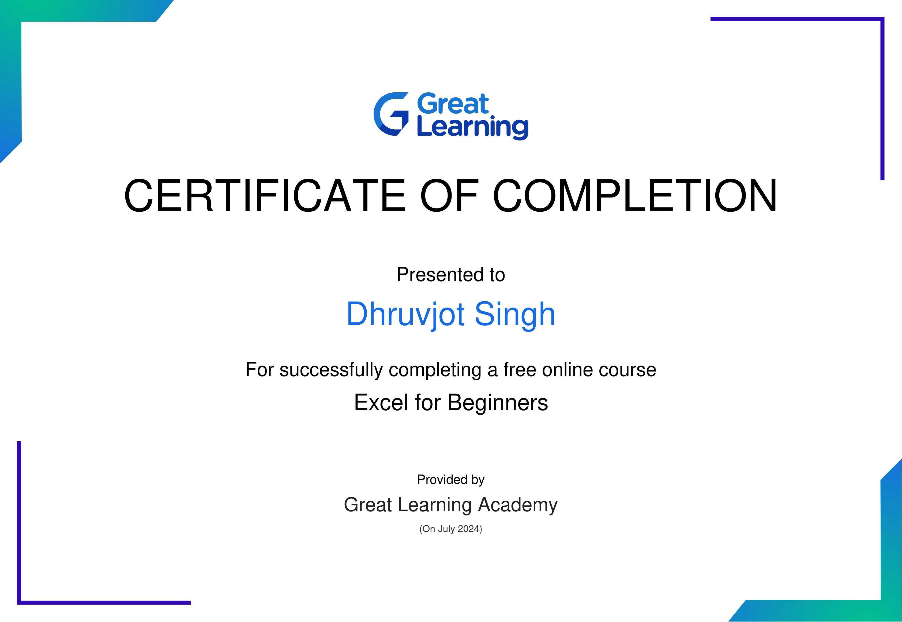

# Profile:-Dhruvjot

"Welcome! I'm Dhruvjot Singh  a dedicated and experienced developer with a talent for creating effective and elegant solutions. With a strong background in computer science and a commitment to excellence, I build web applications that are both functional and beautiful. Explore my portfolio to see my latest work and let's connect to build something amazing together!"

# Personal information 

---  ---  ---

__Name:__ Dhruvjot Singh 

__Education :__ Btech IT ( Information technology)  pursuing 

__College:__ GNDEC (Guru Nanak Dev Engineering college)

__location:__ India,Punjab,ludhiana 

__pin code:__ 141003

__class 12 :__ school of eminence govt school 
__class 10 :__ amrit indo Canadian academy 

__work at :__ part time at Dmart currently doing

__hobbies:__ to explore surrounding and learn more and more

__competitive exam :__ Jee main cleared
jee adv 

# 12 Mark's details 

|subject|  Mark's obtained | total|
|----| ----------|----|
|English |84 |100|
|punjabi| 67 |100|
|physics |76 |100|
|Chemistry |87 |100|
|mathematics |62 |100|
|environmental educ |46| 50|
|computer |78 |100|
|                 |
|grand total| 376 |500|

# Summary

Dhruvjot Singh 

*portfolio*

Highly motivated and experienced [profession/developer/designer] with a strong passion for building innovative and effective solutions. Skilled in programming, with a proven track record of delivering high-quality results. Dedicated to staying up-to-date with industry trends and best practices, and committed to continuous learning and improvement.

*Key Skills:*

- MMicrosoft all 
- corel draw
- Adobe photoshop 
- after effect
- HTML
- CSS
- Javascript
- backend language
- database management 

*Expertise:*

- ggraphics designer
- programming languages
- drawing 

*Personal Qualities:*

- Strong problem-solving skills
- reseaching and learning
- Detail-oriented and organized
- Passionate about learning and growth

# Achievements

excel certification 
Here's a 100-word write-up:

"I'm thrilled to have completed the Excel course from Great Learning and received certification! This achievement demonstrates my proficiency in using Excel to analyze data, create visualizations, and drive business insights. Through this course, I gained hands-on experience with advanced formulas, pivot tables, and charting techniques. I'm now equipped to leverage Excel's powerful tools to drive decision-making and solve real-world problems. This certification showcases my dedication to upskilling and my ability to master industry-relevant skills. I'm excited to apply my newfound expertise to drive success in my professional endeavors!"

# Blog post 
[blog post](https://github.com/Dhruvjot-codes/blog-post-/blob/9bfc34fb75a8db1f63228233e1d571c9cfe3fd94/README.md)

# Social media 

Facebook 

Instagram 

Linked in 

__Contact__ : 9780599488

__Email__ : *dhruvjotsingh21@gmail.com*

